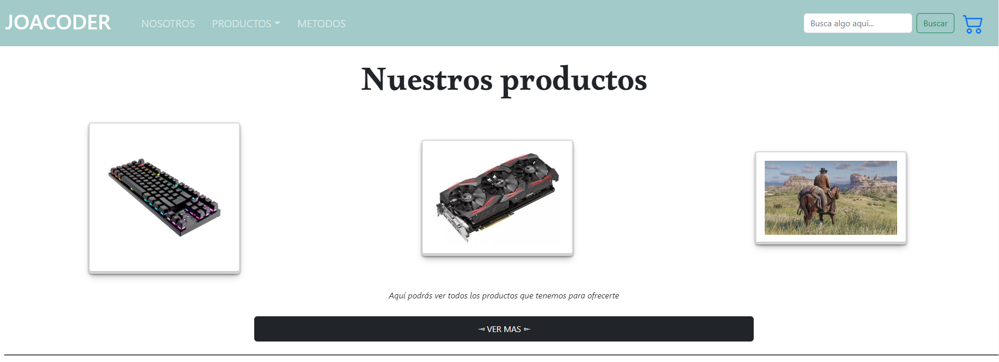
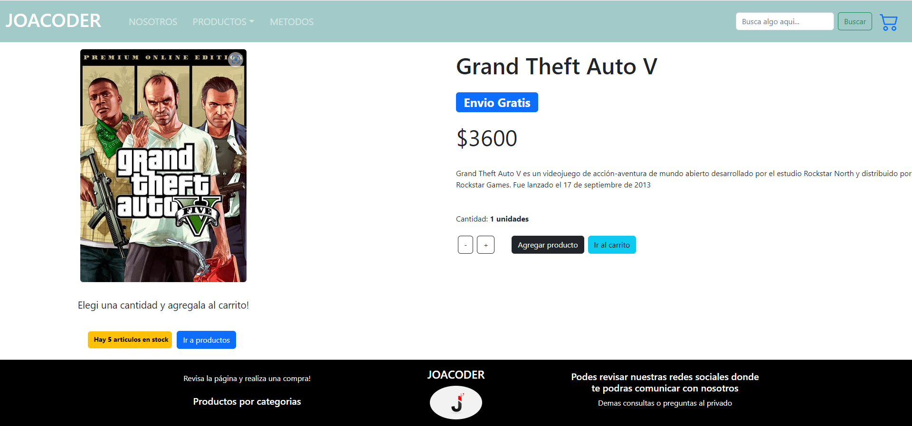

# Gracias por visitar el codigo de mi proyecto :)

### Esta app fue creada para entender y practicar con React. 
Tambien es una manera de mostrar lo que aprendi sobre la computacion, y de demostrar el fanatismo que tengo.

## Demo de la App:
Aqui podras ver nuestros productos a la venta!. Son Videojuegos, perifericos, y componentes
###

        
## Fue construido con: 

###
Utilizando
###


###
Y la base de datos:
###

###
Además:
###
Utilice hooks de react para la funcionalidad (useMemo, useParams, ReactRouter)
###
Y librerias externas como bootstrap, Aos y SweetAlert2 para darle mas estilo!.

## Demo de una compra:
###
Aqui podras ver lo que se puede hacer en nuestro sitio!. Agregar al carrito el/los productos que quieras, no te podras exceder del stock que contiene cada uno, asi mismo finalizar la compra, y con un pequeño formulario te llegara tu orden de compra!



<!-- GETTING STARTED -->

## Getting Started

To get a local copy up and running follow these simple example steps.

### Prerequisites

- npm
  ```sh
  npm install npm@latest -g
  ```

### Installation

1. Clone the repo
   ```sh
   git clone https://github.com/joacoderdev/tiendajoacoder.git
   ```
2. Install NPM packages
   ```sh
   npm install
   ```
3. Run the APP
   ```js
   npm start;
   ```
